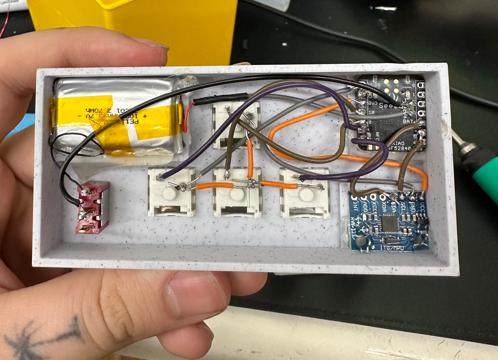

## The 'Liberkey'
This is the result of a weekend sloppily hacking together components I had laying around early in March 2024. I made this strategem wrist keyboard add a fun twist to hell divers. It's a gyro based keyboard that will enter 'strategem input mode' when you raise your arm in front of you. Then you can enter the directional code for the strategem you want and throw it. When you put your arm down it will exit the mode as well. 

It's based on a [Seeed XIAO nRF52840](https://wiki.seeedstudio.com/XIAO_BLE/) with a cheap external gyro, 4 mechanical key switches and a battery upcycled from a disposable vape I found on the ground. 

### Materials Used
* 1 [Seeed XIAO nRF52840](https://amzn.to/49lbOW1)
* 4 Mechanical key switches ( I used [box jades](https://amzn.to/41jWQxm) )
* 1 [Gyroscope](https://amzn.to/3VoWRfE)
* 1 Disposable vape lithium battery
* 1 [toggle switch](https://amzn.to/49nD9Xy)

## The case
You can find the source for the case here on [onshape](https://cad.onshape.com/documents/eca41d7770bbf63c4ba989df/w/0dc85706934b4827cb729b26/e/e91fad5df425877406c2c71a?renderMode=0&uiState=67537f55f576dc5138596441)

## Demo
I talk about a V2 in this but this ended up just being a weekend project that I don't feel like continuing. All the code here is free to use by anyone for anything ya want. 

